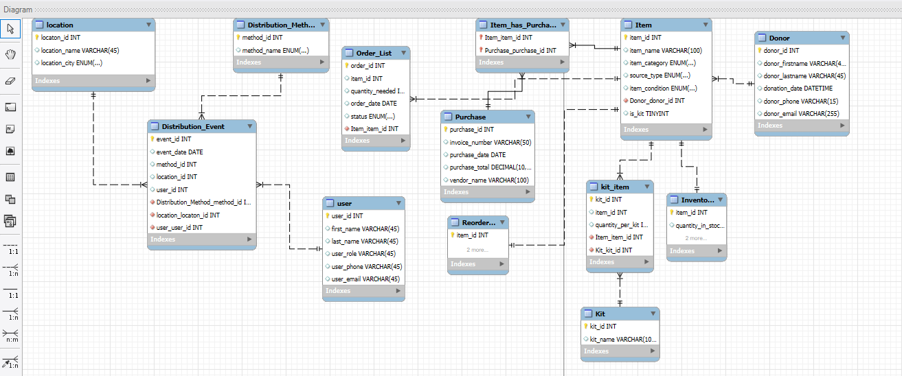

# Database-Project
IT125 Database project inventory, order tracker for a nonprofit organization that delivers essentials to homeless people in the area.

## Written Explanation
Database schema designed to support nonprofit logistics, specifically for inventory tracking, kit assembly, and outreach distribution. The goal is to reflect real-world workflows while maintaining clarity and scalability.

---
### Design Decisions
1. **Normalized Structure**:
   - Used junction tables like 'item_has_purchase' and 'kit_has_item' to handle many-many relationships.
   - Embedded clothing sizes and conditions directly into 'item name' for simplicity.

2. **Operational Relevance**:
   - Included 'Inventory' with 'reorder_threshold' to  support stock monitoring.
   - Created 'Distribution Event', 'Kit_distribution', and 'Item_distribution' to track outreach efforts.
3. **Scalability**:
   - Designed modular tables to allow future expansion.

---
### Challenges
1. **Balancing Normalizations vs. Usability**:
   - Avoided over-complication by embedding attributes like size and condition into item names.
3. **Excel Compatabiliy**:
   - Structured data to be exportable and readable in spreadsheet formats for field items.
5. **Realistic Sample Data**:
   - Populated tables with operationally meaningful entries.

---
### Reasoning

This schema supports nonprofits for community outreach by enabling:

- Accurate tracking of donations and purchases.
- Flexible kit assembly logic.
- Clear distribution records for accountability.
- INventory alerts to prevent stockouts.

